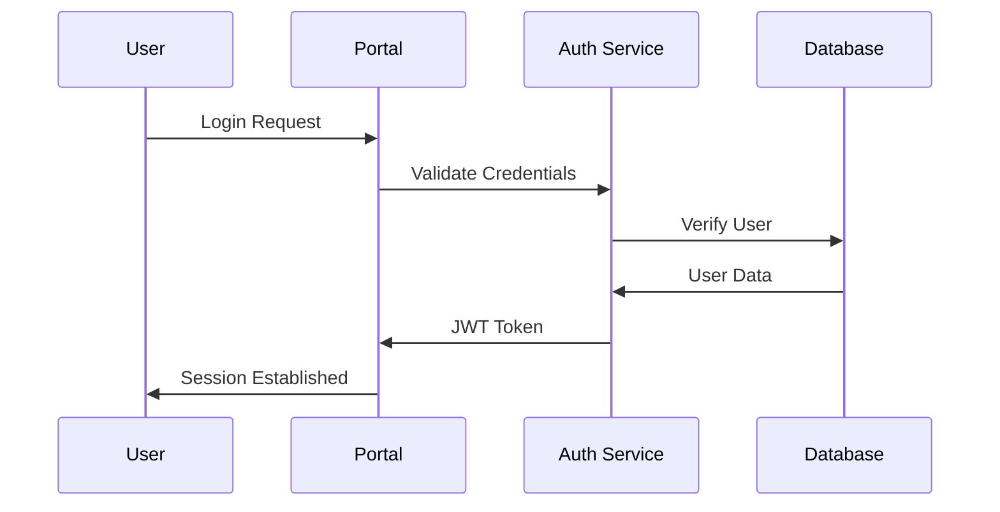

# Architecture & Design

## System Overview

The Enterprise Developer Portal is built with a modern, scalable architecture using Next.js 14 and follows a modular, component-based design approach.

### Tech Stack

```typescript
const techStack = {
  frontend: {
    framework: "Next.js 14",
    language: "TypeScript",
    styling: "Tailwind CSS",
    components: "shadcn/ui",
    stateManagement: "React Hooks",
    dataFetching: "Server Components + API Routes"
  },
  backend: {
    runtime: "Node.js",
    database: "MongoDB",
    caching: "Next.js Cache",
    authentication: "NextAuth.js",
    apiDocs: "OpenAPI/Swagger"
  },
  infrastructure: {
    deployment: "Vercel/Netlify",
    monitoring: "Application Insights",
    cdn: "Vercel Edge Network",
    storage: "MongoDB Atlas"
  }
};
```

## Architecture Patterns

### 1. Server Components Architecture

```typescript
// Server Component Example
export default async function DashboardPage() {
  // Data fetching at the server level
  const data = await fetchDashboardData();
  
  return (
    <Suspense fallback={<Loading />}>
      <DashboardContent initialData={data} />
    </Suspense>
  );
}
```

### 2. Module-Based Organization

```plaintext
app/
├── admin/           # Admin module
├── portal/          # Developer portal module
├── enterprise/      # Enterprise management module
├── documentation/   # Documentation module
└── shared/         # Shared components and utilities
```

## Core Modules

### 1. Admin Module

- User Management
- Role-Based Access Control
- Feature Management
- White Label Configuration
- Analytics Dashboard

### 2. Portal Module

- API Key Management
- Documentation Browser
- Usage Analytics
- Support System
- Developer Sandbox

### 3. Enterprise Module

- Organization Management
- User Management
- Access Control
- Analytics
- Settings Management

## Security Architecture

### Authentication Flow



### Authorization Layers

1. **Role-Based Access Control (RBAC)**
   - Predefined roles
   - Custom role support
   - Permission inheritance

2. **Feature Flags**
   - Module-level controls
   - Plan-based restrictions
   - A/B testing support

## Data Architecture

### Data Models

```typescript
interface Organization {
  id: string;
  name: string;
  plan: 'growth' | 'business' | 'enterprise';
  status: 'active' | 'suspended';
  settings: {
    rateLimit: number;
    customDomain?: string;
  };
  apiKeys: ApiKey[];
  users: User[];
}

interface User {
  id: string;
  type: 'internal' | 'external';
  role: UserRole;
  permissions: Permission[];
  organizations?: string[];
}
```

### Data Flow

1. **API Request Flow**
   - Request validation
   - Authentication
   - Rate limiting
   - Request processing
   - Response caching
   - Error handling

2. **Event System**
   - Webhook delivery
   - Audit logging
   - Analytics tracking
   - Notification dispatch

## Performance Optimizations

### 1. Caching Strategy

```typescript
// API Route with caching
export async function GET() {
  const cacheKey = 'dashboard-stats';
  
  // Check cache first
  const cached = await cache.get(cacheKey);
  if (cached) return cached;
  
  // Fetch and cache data
  const data = await fetchDashboardStats();
  await cache.set(cacheKey, data, '5m');
  
  return data;
}
```

### 2. Code Splitting

- Dynamic imports
- Route-based splitting
- Component lazy loading

## Monitoring & Observability

### 1. Performance Metrics

- API response times
- Error rates
- Resource utilization
- User engagement

### 2. Logging Strategy

```typescript
interface LogEntry {
  level: 'info' | 'warn' | 'error';
  module: string;
  action: string;
  userId?: string;
  organizationId?: string;
  metadata?: Record<string, any>;
  timestamp: Date;
}
```

## Deployment Architecture

### 1. CI/CD Pipeline

```yaml
steps:
  - name: Build
    run: npm run build
    
  - name: Test
    run: npm run test
    
  - name: Deploy
    if: branch = main
    run: npm run deploy
```

### 2. Environment Strategy

- Development
- Staging
- Production
- Preview deployments

## Integration Patterns

### 1. API Integration

```typescript
interface ApiClient {
  baseURL: string;
  headers: Record<string, string>;
  interceptors: {
    request: RequestInterceptor[];
    response: ResponseInterceptor[];
  };
}
```

### 2. Webhook System

```typescript
interface WebhookConfig {
  url: string;
  events: string[];
  secret: string;
  retryConfig: {
    maxAttempts: number;
    backoff: 'linear' | 'exponential';
  };
}
```

## Future Considerations

1. **Scalability**
   - Microservices migration path
   - Multi-region deployment
   - Enhanced caching strategies

2. **Feature Roadmap**
   - Advanced analytics
   - Machine learning integration
   - Enhanced security features

3. **Technical Debt**
   - Regular dependency updates
   - Code quality monitoring
   - Performance optimization