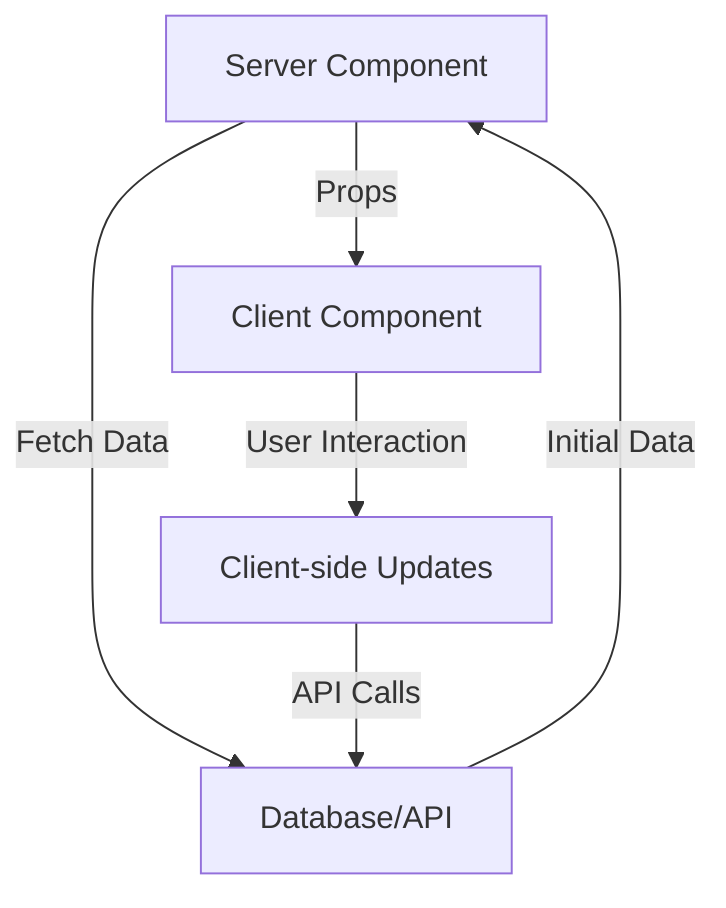

# Server-Side Rendering (SSR) Implementation

## Overview

Our Enterprise Developer Portal implements a robust Server-Side Rendering (SSR) architecture using Next.js 14's App Router and React Server Components. This approach optimizes performance, improves SEO, and enhances user experience.

## Architecture Pattern

### 1. Server Components Structure

```typescript
// Page Component Pattern
export default async function DashboardPage() {
  // Server-side data fetching
  const data = await fetchDashboardData();

  return (
    <Suspense fallback={<LoadingSpinner />}>
      {/* Client Component for interactivity */}
      <DashboardContent initialData={data} />
    </Suspense>
  );
}
```

### 2. Data Flow Pattern



## Implementation Details

### 1. Server Components

```typescript
// app/admin/users/page.tsx
export const dynamic = 'force-dynamic'; // Disable static generation

export default async function UsersPage() {
  // Server-side data fetching
  const initialUsers = await getUsers();

  return (
    <div className="space-y-6">
      <div>
        <h3 className="text-lg font-medium">Users</h3>
        <p className="text-sm text-muted-foreground">
          Manage all internal and external users
        </p>
      </div>

      <Suspense fallback={<LoadingUsers />}>
        <UserContent initialUsers={initialUsers} />
      </Suspense>
    </div>
  );
}
```

### 2. Loading States

```typescript
// app/admin/users/loading.tsx
export default function Loading() {
  return (
    <div className="space-y-6">
      <div>
        <h3 className="text-lg font-medium">Users</h3>
        <p className="text-sm text-muted-foreground">Loading...</p>
      </div>
      <LoadingSpinner />
    </div>
  );
}
```

### 3. Error Handling

```typescript
// app/admin/users/error.tsx
"use client";

export default function Error({
  error,
  reset,
}: {
  error: Error & { digest?: string };
  reset: () => void;
}) {
  return (
    <Card>
      <CardContent className="flex flex-col items-center justify-center min-h-[400px] gap-4">
        <AlertTriangle className="h-8 w-4 text-destructive" />
        <div className="text-center">
          <h3 className="font-semibold">Error Loading Users</h3>
          <p className="text-sm text-muted-foreground">{error.message}</p>
        </div>
        <Button variant="outline" onClick={() => reset()}>
          Try Again
        </Button>
      </CardContent>
    </Card>
  );
}
```

### 4. Client Components

```typescript
"use client";

interface ContentProps {
  initialData: any;
}

export function DashboardContent({ initialData }: ContentProps) {
  // Client-side state management
  const [data, setData] = useState(initialData);

  // Interactive features
  const handleRefresh = async () => {
    const newData = await fetchUpdatedData();
    setData(newData);
  };

  return (
    // Interactive UI components
  );
}
```

## Caching Strategy

### 1. Route Segment Config

```typescript
// Dynamic data fetching
export const dynamic = 'force-dynamic';

// Revalidate at specific intervals
export const revalidate = 60; // seconds
```

### 2. Data Fetching Options

```typescript
// Fetch with caching options
const getData = async () => {
  const res = await fetch('/api/data', {
    next: { 
      revalidate: 60 // Cache for 1 minute
    }
  });
  return res.json();
};
```

## Loading States

### 1. Route Loading

```typescript
// app/dashboard/loading.tsx
export default function Loading() {
  return (
    <Card>
      <CardContent className="flex items-center justify-center min-h-[400px]">
        <div className="flex flex-col items-center gap-4">
          <div className="h-8 w-8 animate-spin rounded-full border-4 border-primary border-t-transparent" />
          <p className="text-sm text-muted-foreground">Loading...</p>
        </div>
      </CardContent>
    </Card>
  );
}
```

### 2. Suspense Boundaries

```typescript
<Suspense fallback={<LoadingSpinner />}>
  <SlowComponent />
</Suspense>
```

## Error Handling

### 1. Error Boundaries

```typescript
// app/[section]/error.tsx
"use client";

export default function Error({
  error,
  reset,
}: {
  error: Error & { digest?: string };
  reset: () => void;
}) {
  return (
    <ErrorDisplay 
      message={error.message}
      onRetry={reset}
    />
  );
}
```

### 2. Not Found Handling

```typescript
// app/[section]/not-found.tsx
import { notFound } from "next/navigation";

export default async function Page({ params }) {
  const item = await fetchItem(params.id);
  
  if (!item) {
    notFound();
  }

  return <ItemDisplay item={item} />;
}
```

## Performance Optimizations

### 1. Component Structure

```typescript
// Optimized component splitting
├── page.tsx              # Server Component
├── loading.tsx           # Loading UI
├── error.tsx            # Error handling
├── not-found.tsx        # 404 handling
└── components/
    ├── content.tsx      # Client Component
    └── loading-ui.tsx   # Shared loading states
```

### 2. Data Prefetching

```typescript
// Parallel data fetching
const [userData, statsData] = await Promise.all([
  fetchUserData(),
  fetchStats()
]);
```

## Best Practices

1. **Server Components First**
   - Use Server Components by default
   - Convert to Client Components only when needed
   - Keep interactivity close to the user action

2. **Loading States**
   - Implement loading UI at every route level
   - Use Suspense boundaries strategically
   - Show meaningful loading indicators

3. **Error Handling**
   - Implement error boundaries at route level
   - Provide clear error messages
   - Enable retry mechanisms

4. **Data Flow**
   - Pass initial data from server to client
   - Implement optimistic updates
   - Handle stale data scenarios

## Common Patterns

### 1. Route Handler Pattern

```typescript
// Route handler with SSR
export async function GET(request: Request) {
  const data = await fetchData();
  return NextResponse.json(data);
}
```

### 2. Dynamic Routes Pattern

```typescript
// Dynamic route with SSR
export default async function ItemPage({ params }: { params: { id: string } }) {
  const item = await fetchItem(params.id);
  
  return (
    <Suspense fallback={<LoadingSpinner />}>
      <ItemContent initialData={item} />
    </Suspense>
  );
}
```

### 3. Search Params Pattern

```typescript
// Handle search parameters
export default async function SearchPage({ 
  searchParams 
}: { 
  searchParams: { q?: string } 
}) {
  const results = await searchItems(searchParams.q);
  
  return (
    <Suspense fallback={<LoadingResults />}>
      <SearchResults initialResults={results} />
    </Suspense>
  );
}
```

## Monitoring & Debugging

### 1. Performance Monitoring

```typescript
// Server timing headers
export async function GET() {
  const start = performance.now();
  const data = await fetchData();
  const end = performance.now();
  
  console.log(`Data fetch took ${end - start}ms`);
  return NextResponse.json(data);
}
```

### 2. Error Tracking

```typescript
// Error boundary with logging
try {
  const data = await fetchData();
  return data;
} catch (error) {
  console.error('Error fetching data:', error);
  throw new Error('Failed to fetch data');
}
```

## Migration Guide

### 1. From Pages to App Router

```diff
- // pages/dashboard.tsx
- export default function Dashboard({ data }) {
-   return <DashboardUI data={data} />;
- }

+ // app/dashboard/page.tsx
+ export default async function Dashboard() {
+   const data = await fetchDashboardData();
+   return (
+     <Suspense fallback={<Loading />}>
+       <DashboardContent initialData={data} />
+     </Suspense>
+   );
+ }
```

### 2. From Client-Side to Server-Side

```diff
- // Fetch on client
- useEffect(() => {
-   fetch('/api/data').then(res => setData(res));
- }, []);

+ // Pass data from server
+ const data = await fetchData();
+ return <Component initialData={data} />;
```